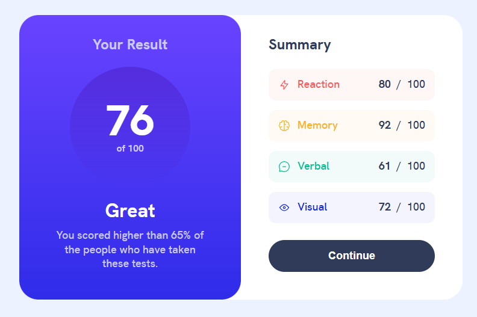
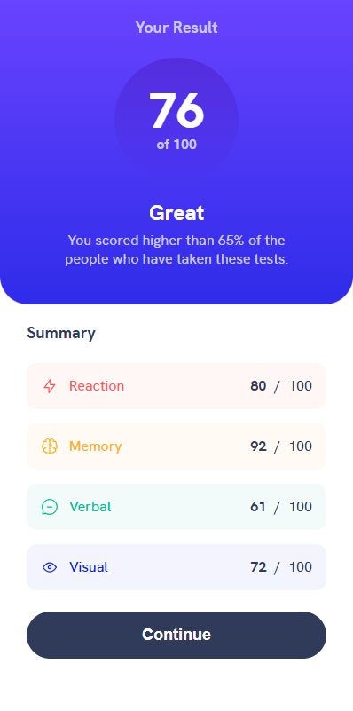

# Frontend Mentor - Results summary component solution

This is a solution to the [Results summary component challenge on Frontend Mentor](https://www.frontendmentor.io/challenges/results-summary-component-CE_K6s0maV). Frontend Mentor challenges help you improve your coding skills by building realistic projects.

## Table of contents

- [Overview](#overview)
  - [The challenge](#the-challenge)
  - [Screenshot](#screenshot)
  - [Links](#links)
- [My process](#my-process)
  - [Built with](#built-with)
  - [What I learned](#what-i-learned)
  - [Continued development](#continued-development)
  - [Useful resources](#useful-resources)
- [Author](#author)

## Overview

### The challenge

Users should be able to:

- View the optimal layout for the interface depending on their device's screen size
- See hover and focus states for all interactive elements on the page
- **Bonus**: Use the local JSON data to dynamically populate the content

### Screenshot

### Links

- Solution URL: [Githup repo](https://github.com/morauszkia/fm-results-summary-component)
- Live Site URL: [Github Pages](https://morauszkia.github.io/fm-results-summary-component/)

## My process

### Built with

- Semantic HTML5 markup
- CSS custom properties
- Flexbox
- Mobile-first workflow
- [Vue.js](https://vuejs.org/) - JS framework
- [Vite](https://vite.dev) - Build Tool

### What I learned

It was a while since I last worked with Vue.js, and it was great to revisit this framework. I like Vue.js' 1 file / component approach to building components by colocating template, styles and logic in a single file, while separating concerns within the file.

### Continued development

In the future I want to use Vue.js more often to build more complex applications. I would also like to become more familiar with static asset handling in Vite+Vue applications.

I am also giving Svelte a try by [building the same components](https://github.com/morauszkia/fm-results-summary-svelte). Check out the linked repo, if you're curious.

### Useful resources

- [Vue docs](https://vuejs.org/guide/introduction.html)
- [Vite docs](https://vite.dev/guide/assets.html) - These helped me a lot, especially with static asset handling and deployment.

## Author

- Frontend Mentor - [@mantis](https://www.frontendmentor.io/profile/morauszkia)
- X - [@mantis_hu86](https://x.com/mantis_hu86)
- Github -[@mantis](https://github.com/morauszkia)
- LinkedIn - [András Morauszki](https://www.linkedin.com/in/andras-morauszki/)
